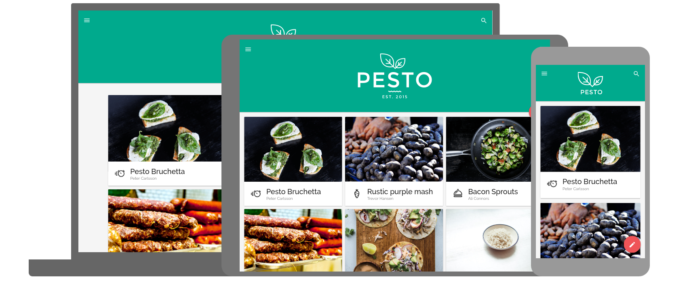

# Responsive Screenshots


```shell
# install dependencies
npm install
# start a chrome instance with remote debugging
google-chrome --headless --disable-gpu --hide-scrollbars --remote-debugging-port=9222 &
# take a responsive screenshot
node index.js --url="https://material-adaptive.firebaseapp.com/pesto/app/dist.html"
```


### requirement

Chrome 60+, Node 8+

### credits
frames are from https://material.io/resizer/

original screenshot script from https://github.com/schnerd/chrome-headless-screenshots
